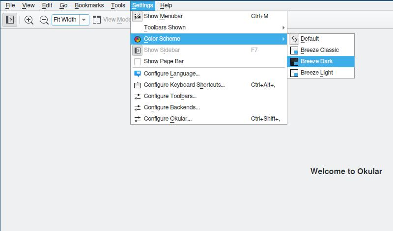
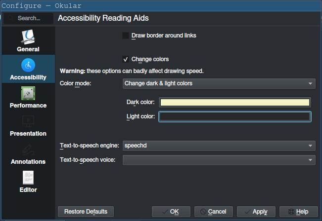

# arch-config
My personal Arch Linux configuration.

## 1. Setup 
1 - [Install Arch Linux.](https://wiki.archlinux.org/title/Installation_guide)

2 - Log in as root.

3 - Copy or clone the repository:
```bash
# cd /root 
# git clone https://github.com/valentinoamato/arch-config.git
```
4 - Run [rootsetup.sh](./scripts/rootsetup.sh):

This script will ask for a name, then create a new user and move the repository to its home directory.
```bash
# cd arch-config/scripts
# ./rootsetup.sh
```
5 - Log in as the new user.

6 - Ensure you are connected to the internet:
```bash
$ ping archlinux.org
```

Consider enabling and starting [NetworkManager](https://wiki.archlinux.org/title/NetworkManager):
```bash
# systemctl enable --now NetworkManager
```
7 - Run [usersetup.sh](./scripts/usersetup.sh):

This will install all the required packages and apply the configuration for the new user.
It can also be used later to apply updates after pulling changes.
```bash
# chown -R "$(whoami)" ~/arch-config
$ cd ~/arch-config/scripts/
$ ./usersetup.sh
```
8 - Reboot the system:
```bash
# systemctl reboot
```
## 2. Application configuration
Some of the installed applications require manual configuration which will be explained in this section.
### 2.1 Okular
#### Set the theme to Breeze Dark:


#### Change colors:
Go to `Settings > Configure Okular > Accessibility > Change colors`.
Then set dark color to `#F3F5C6` and light color to `#282828`



### 2.2 Easyeffects
#### Import preset:
First add the equalizer effect:

Then go to `Import Preset > APO` and select the [preset](./config/easyeffects):

## 3. See also
- [General Recommendations](https://wiki.archlinux.org/title/General_recommendations)
- [Generating a new SSH key for GitHub](https://docs.github.com/en/authentication/connecting-to-github-with-ssh/generating-a-new-ssh-key-and-adding-it-to-the-ssh-agent)
 
## 4. License

This project is licensed under the [Unlicense](./LICENSE).
